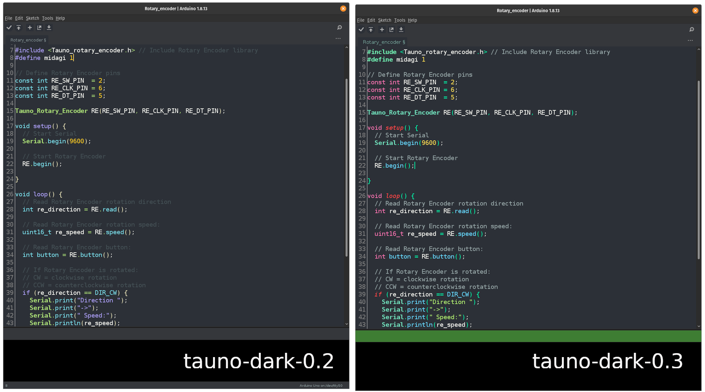
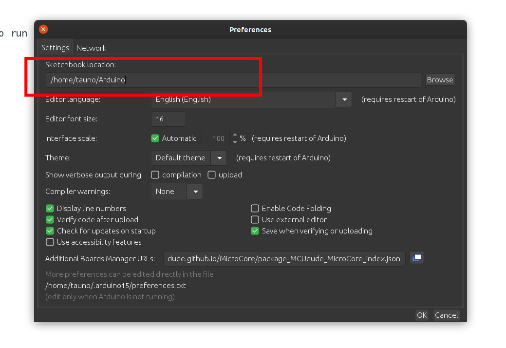
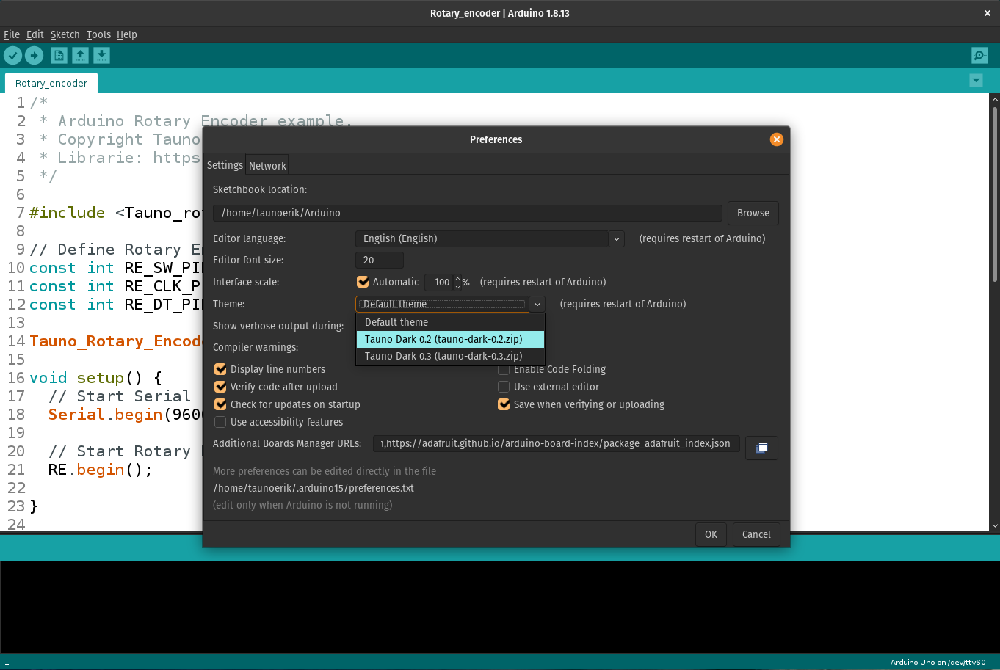

# Arduino dark theme

* Uses Arduino **built-in theme mechanism**
* SVG icons
* Two colour versions: 0.2 and 0.3

## Install

### 1. Download

Download [tauno-dark-0.2.zip](https://github.com/taunoe/arduino-dark-theme/releases/download/v0.3/tauno-dark-0.2.zip) or/and [tauno-dark-0.3.zip](https://github.com/taunoe/arduino-dark-theme/releases/download/v0.3/tauno-dark-0.3.zip).

### 2. Sketchbook location

Find your Arduino Sketchbook location: Arduino IDE > File > Preferences

In my case /home/tauno/Arduino (on a Linux/Mac).

On **Windows** this would be typically be as a sub-folder of  your "documents" folder at %HOMEDRIVE%%HOMEPATH%\Documents\Arduino

### 3. Theme folder

Go to that location and make new folder (if it does not exist already): **theme**

In my case (on Linux) /home/tauno/Arduino/theme or as an example on Windows C:\Users\Tauno\Documents\Arduino\Theme

### 4. Copy

Copy downloaded **tauno-dark-0.2.zip** or/and **tauno-dark-0.3.zip** to theme folder.

### 5. Select

Open Arduino IDE > File > Preferences and select new theme:

### 6. Restart

Restart Arduino IDE and have fun.
___

Copyright 2021 Tauno Erik https://taunoerik.art
